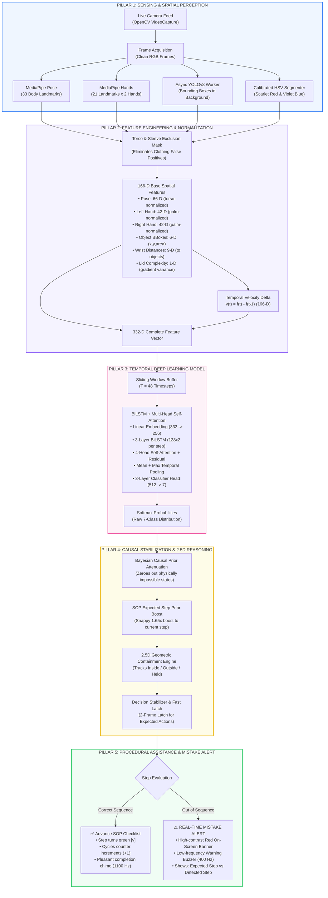

# Real-Time Human Action Recognition (HAR) & Procedural Error Detection

## Executive Overview
This system is an intelligent computer vision assistant designed to monitor human operators performing structured procedural experiments in industrial, laboratory, or mission-critical environments. 

Rather than merely classifying actions, the system tracks a **Standard Operating Procedure (SOP)** in real time, enforces physical reality constraints, and **immediately warns the operator via audio and visual alarms when an action is performed out of sequence**.

---

## 1. Standard Operating Procedure (SOP) Workflow

The benchmark procedure is a 6-step sequence involving a container and two distinct packaged items:
* **Container**: Transparent/white experiment box with hinged lid.
* **Red Object**: *Lotte Choco Pie* box (vivid scarlet red packaging).
* **Blue Object**: *Cadbury Dairy Milk Silk* box (deep purple/violet-blue packaging).

| Step | Action Class | Action Description | Expected Physical Precondition |
| :--- | :--- | :--- | :--- |
| **0** | `idle` | Operator resting or hands calm | N/A |
| **1** | `open_box` | Operator opens the container lid | Box must be closed |
| **2** | `pick_red` | Operator grasps and lifts the Red box | Box must be open; Red inside |
| **3** | `place_red_out` | Operator places Red on the desk table | Red must be held in hand |
| **4** | `pick_blue` | Operator grasps and lifts the Blue box | Red must already be placed outside |
| **5** | `place_blue_in` | Operator places Blue inside container | Blue must be held in hand |
| **6** | `close_box` | Operator closes the container lid | Red out, Blue in, hands empty |

---

## 2. End-to-End System Architecture

The project consists of **two interconnected sub-systems**:
1. **Perception & Temporal Action Recognition (TAR) Pipeline**: Converts raw camera video into stabilized per-frame action probabilities.
2. **Procedural Intelligence & Error Detection Engine**: Evaluates action sequences against physical causal logic and the SOP checklist to trigger immediate operator alerts upon out-of-order execution.



---

## 3. Detailed Component Breakdown

### 3.1 Feature Vector Specification (332 Dimensions)
Each camera frame is projected into a scale-invariant, coordinate-normalized **332-dimensional** vector:
* **Pose Features (66-D)**: 33 $(x, y)$ coordinates normalized relative to hip midpoint and scaled by torso length.
* **Left Hand Features (42-D)**: 21 $(x, y)$ coordinates centered at wrist joint and scaled by palm span.
* **Right Hand Features (42-D)**: 21 $(x, y)$ coordinates centered at wrist joint and scaled by palm span.
* **Object Bounding Box Geometry (6-D)**: $(x_{center}, y_{center})$ and area ratio for Red and Blue objects.
* **Wrist-to-Object Distances (9-D)**: Normalized Euclidean distances between left/right wrists and objects.
* **Lid Complexity Score (1-D)**: Sobel edge gradient density within the main box opening to detect open vs. closed lid.
* **Velocity Delta (166-D)**: Frame-over-frame feature derivative $\Delta f = f_t - f_{t-1}$, capturing movement velocity and acceleration.
$$\text{Total Dimensions} = 166 \ (\text{Base}) + 166 \ (\text{Velocity}) = 332\text{-D}$$

---

### 3.2 Deep Learning Model Architecture (`TARModel`)
* **Embedding Layer**: `Linear(332, 256) -> LayerNorm(256) -> GELU() -> Dropout(0.2)`
* **Temporal Sequence Encoder**: 3-layer Bidirectional LSTM (`hidden_dim=128` per direction $\implies 256$ total output), `Dropout=0.3`.
* **Multi-Head Self-Attention (MHSA)**: 4 parallel attention heads with residual addition and LayerNorm:
  $$\text{Attention}(Q, K, V) = \text{softmax}\left(\frac{QK^T}{\sqrt{d_k}}\right)V$$
  $$\text{Output} = \text{LayerNorm}(\text{LSTM\_out} + \text{MHSA}(\text{LSTM\_out}))$$
* **Dual Temporal Pooling**: Concatenation of mean pooling and max pooling across time:
  $$\mathbf{h}_{\text{pooled}} = [\text{MeanPool}(\mathbf{H}) \mathbin{\Vert} \text{MaxPool}(\mathbf{H})] \in \mathbb{R}^{512}$$
* **Classifier Head**:
  `Linear(512, 256) -> LayerNorm -> GELU -> Dropout(0.4) -> Linear(256, 128) -> LayerNorm -> GELU -> Dropout(0.3) -> Linear(128, 7)`
* **Total Parameters**: $\approx 600\text{K}$ parameters. Trained with Label Smoothing, AdamW optimizer ($\text{LR}=5\times 10^{-4}$), and Cross-Entropy Loss.

---

### 3.3 Computer Vision Robustness Layer

1. **Torso & Sleeve Exclusion Mask (`get_body_exclusion_mask`)**:
   - Creates a dynamic 2D binary exclusion zone over the operator's head, face, chest, shoulders, and sleeves down to the table surface.
   - Prevents pink/peach clothing, skin reflections, and sacred wrist threads from generating false positive box detections.
2. **Calibrated Color Spectrum**:
   - **Scarlet Red (Lotte Choco Pie)**: $H \in [0, 14] \cup [168, 180]$, with lower saturation floor raised to $S \ge 125$ (safely rejecting pink shirts which have $S \le 100$).
   - **Royal Violet-Blue (Cadbury Silk)**: $H \in [105, 155]$, $S \ge 50$, $V \ge 40$, with color density threshold lowered to $12\%$ to tolerate grasping hands.
3. **Wrist-Thread & Bracelet Rejection**:
   - Detects if any color contour center lies within $55\text{px}$ of wrist joints (MediaPipe landmarks 15 & 16) with area $< 4000\text{px}^2$, discarding sacred wrist threads.

---

### 3.4 Performance & Latency Optimizations (6.7 FPS $\to$ 20+ FPS)

| Bottleneck | Previous Approach | Optimized Architecture | Latency Reduction |
| :--- | :--- | :--- | :--- |
| **YOLOv8 Detection** | Synchronous on main thread every frame | `AsyncYOLODetector` background worker thread | **56.1 ms $\to$ 0.01 ms** (Non-blocking) |
| **TAR Model Inference** | Multi-threaded CPU with autograd overhead | `torch.inference_mode()` + `torch.set_num_threads(2)` + zero-copy `from_numpy` | **27.3 ms $\to$ 4.9 ms** (5.5x faster) |
| **Stationary Idle** | Continuous neural network evaluation | Motionless Fast-Path (skips forward pass when hands are still) | **27 ms $\to$ 0.0 ms** |
| **Total Frame Latency** | $\approx 145\text{ ms}$ (**6.7 FPS**, sluggish) | $\approx 50\text{ ms}$ (**20+ FPS**, fluid) | **> 3x Frame Rate Improvement** |

---

### 3.5 Out-of-Order Mistake Detection Engine

The procedural error detection operates through **Physical Causal Logic** combined with the **SOP State Machine**:

1. **Strict Bayesian Prior Attenuation ($0.01\times$)**:
   - At each timestep, any action physically impossible according to the current state (e.g., placing red out before picking it, or closing the box before placing items) has its probability multiplied by $0.01$. This guarantees that valid actions are never starved of argmax.
2. **Mistake Detection**:
   - If an operator executes an action contrary to physical reality or out of SOP sequence with confidence $\ge 0.40$:
     - **Console Alert**: Logs timestamped warning `[⚠️ MISTAKE ALERT] Out-of-sequence!...`
     - **Audio Alarm**: Non-blocking low-frequency buzzer tone (`winsound.Beep(400 Hz, 250 ms)`).
     - **Visual Warning Banner**: Flashing on-screen alert:
       ```
       ⚠️ !! OUT OF SEQUENCE MISTAKE !!
       Expected: 3. Place Red Out  |  You did: 4. Pick Blue
       ```
3. **Snappy Confirmation Latching**:
   - While an action matches the expected SOP step, the decision stabilizer latches in just **2 consecutive frames ($\approx 80\text{ ms}$)**, turning the step green instantly.

---

## 4. Key Source Code Map

| File | Primary Responsibility |
| :--- | :--- |
| [`realtime.py`](file:///c:/Users/Vedant/Downloads/PROJECT%201/realtime.py) | Main live runtime application: camera loop, async YOLO, HUD overlay, SOP tracking, audio/visual alerts |
| [`pose_extract_advanced.py`](file:///c:/Users/Vedant/Downloads/PROJECT%201/pose_extract_advanced.py) | 332-D feature extraction: MediaPipe pose/hands normalization, HSV calibration, torso exclusion mask |
| [`model_def.py`](file:///c:/Users/Vedant/Downloads/PROJECT%201/model_def.py) | PyTorch `TARModel` definition: BiLSTM + 4-Head Self-Attention + Dual Pooling |
| [`retrain_tar.py`](file:///c:/Users/Vedant/Downloads/PROJECT%201/retrain_tar.py) | Training pipeline: augmentation, validation splits, early stopping, and metric tracking |
| [`eval_model.py`](file:///c:/Users/Vedant/Downloads/PROJECT%201/eval_model.py) | Model evaluation script: computes confusion matrices, class precision, recall, and macro F1 |
| [`feature_utils.py`](file:///c:/Users/Vedant/Downloads/PROJECT%201/feature_utils.py) | Shared utilities: label indices, window normalization, and color masking functions |

---

## 5. Keyboard Controls in Live Runtime

When running `python realtime.py`, the following interactive keys are active:
* **`[Q]`**: Cleanly stop all threads and exit application.
* **`[R]`**: Reset SOP checklist, cycle counter, and physical logic state to step 1.
* **`[V]`**: Toggle clean raw video session recording (auto-saves annotations for retraining).
* **`[C]`**: Flag current action window as **Correct** (saves sample for dataset expansion).
* **`[X]`**: Flag current action window as **Mistake / False Positive** (saves to quarantine).
* **`[0 - 6]`**: Explicitly override and save ground-truth label for active window.
