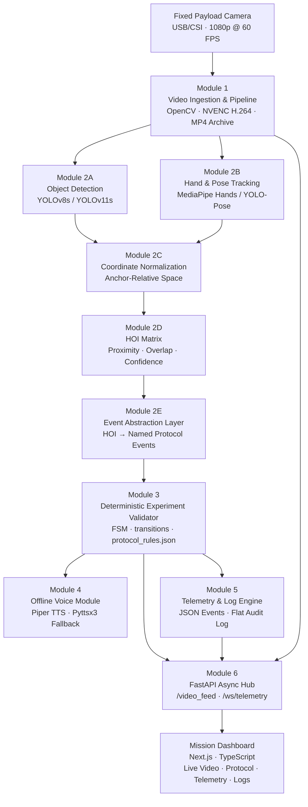

# AstroFlow-AI

> **Offline Edge-AI Copilot for Bharatiya Antariksh Station (BAS) Experiment Protocols**  
> Recognize. Validate. Guide. Log. — All locally, all in real time.

---

## Overview

AstroFlow-AI is a mission-oriented experiment monitoring platform designed for controlled scientific experiments in orbital and space-analog environments.

It combines real-time computer vision, human activity recognition, and deterministic protocol validation on a single offline edge compute node. A fixed payload camera observes the experiment workspace. The system detects experiment objects and operator interactions, converts visual events into protocol-meaningful actions, and validates those actions against a predefined experiment procedure using a Finite State Machine.

When an action is correct — the protocol advances. When something is missed, out of order, or performed at the wrong time — the system immediately alerts the operator and supervisor through visual warnings and voice prompts, and records the deviation in the mission audit log.

No cloud. No internet connection. No external servers. The entire inference, validation, and feedback pipeline runs on an NVIDIA RTX 3050 Edge Inference Server at the experiment site.

---

## Why This Is Different

Most Human Activity Recognition systems are designed to answer a broad observational question:

> "**What is this person doing?**"

AstroFlow-AI answers a much more specific operational question:

> "**What experiment action is occurring, and is it valid according to the current protocol state?**"

| Dimension | Traditional HAR / CCTV | AstroFlow-AI |
|---|---|---|
| Activity vocabulary | Generic (walking, gesturing, sitting) | Protocol-specific (picking up vial, inserting syringe, activating observation port) |
| Sequence awareness | None | Full FSM — ordered steps, timing, anomaly detection |
| Protocol validation | None | Deterministic validation via `protocol_rules.json` |
| Object awareness | Generic (person, object) | Domain-specific experiment equipment |
| Interaction understanding | Coarse or none | HOI matrix: proximity, overlap, confidence |
| Audio guidance | None | Offline TTS (Piper) — voice prompts and warnings |
| Connectivity | Cloud-dependent | 100% local — zero network dependency |
| Audit trail | Raw video only | Structured JSON events + flat text audit log |

The AI determines *"What is happening?"*  
The Deterministic Experiment Validator determines *"Is this what should be happening?"*

**This separation is the central architectural principle of AstroFlow-AI.**

---

## Architecture



---

## Core Modules

### Module 1 — Video Ingestion & Pipeline
Camera frame acquisition via `cv2.VideoCapture`. Concurrent NVENC H.264 hardware-accelerated archival to MP4. Threaded frame queue to inference pipeline. MJPEG and optional RTSP/WebRTC local bridge.

### Module 2 — Computer Vision & HAR Engine
Multi-stage perception pipeline: YOLOv8s/YOLOv11s object detection, MediaPipe Hands/YOLO-Pose keypoint tracking, anchor-relative coordinate normalization, HOI matrix computation, and event abstraction. Outputs named protocol events — never raw protocol commands.

### Module 3 — Deterministic Experiment Validator
Finite State Machine built at runtime from `protocol_rules.json`. Validates every incoming protocol event against the current expected step. Detects invalid actions, skipped steps, out-of-order actions, premature actions, repeated actions, and step timeouts. Contains zero hardcoded protocol logic.

### Module 4 — Offline Voice Module
Async voice queue consuming FSM and anomaly events. Piper TTS (local `.onnx` model) for offline neural speech synthesis. Pyttsx3 system TTS fallback. Priority queue with CRITICAL-level non-discard guarantee.

### Module 5 — Telemetry & Log Engine
Structured JSON Lines event log per session. Flat text audit trail per session. Real-time system metrics collection (`pynvml` for GPU, `psutil` for CPU/RAM). Append-only write policy.

### Module 6 — FastAPI Async Hub
`GET /video_feed` — MJPEG annotated video stream. `WS /ws/telemetry` — real-time WebSocket for telemetry, protocol events, anomaly alerts, and system status. REST session control endpoints. All routes are async.

---

## AI Pipeline

```
Camera Frame
    ↓
[2A] Object Detection   →  {person, vial, syringe, plunger, observation_port, gloves}
    ↓
[2B] Hand & Pose Tracking  →  {21 keypoints per hand, handedness, wrist/fingertip}
    ↓
[2C] Coordinate Normalization  →  {anchor-relative [0,1] coordinates}
    ↓
[2D] HOI Matrix  →  {distance, bbox-IoU, interaction class, confidence, duration}
    ↓
[2E] Event Abstraction  →  {PICK_UP_VIAL, INSERT_SYRINGE_TO_VIAL, ...}
    ↓
[M3] FSM Validation  →  {VALID transition | ANOMALY: type + severity}
    ↓
    ├── Voice Prompt (Module 4)
    ├── Audit Log Entry (Module 5)
    └── WebSocket Push (Module 6) → Mission Dashboard
```

HAR in this system does not mean recognizing generic activities. It means recognizing **protocol-relevant interactions** such as:

- Approaching / reaching toward an experiment object
- Picking up, holding, or transferring an object
- Inserting a syringe into a vial
- Positioning an object at an observation port
- Completing a protocol step

The exact set of recognized actions is defined per experiment in `protocol_rules.json`. The engine does not assume any particular experiment structure.

---

## Dataset

A custom dataset is required because no existing public HAR dataset contains the domain-specific interactions, objects, and protocol sequences relevant to controlled experiment procedures in a payload rack workspace.

**The custom dataset must cover five layers:**

| Layer | Content |
|---|---|
| A — Human Detection | Operator bounding boxes, body pose keypoints, hand keypoints |
| B — Object Detection | Vial, syringe, plunger, observation port, gloves, rig fixtures |
| C — HOI Labels | Near, touching, holding, transferring, inserting, placing |
| D — Action Labels | Protocol-specific action segments (temporally annotated) |
| E — Sequence Data | Full sessions — correct execution and deliberate incorrect sequences |

Dataset collection and annotation are planned in Phase 4 of the implementation roadmap. See [Implementation Doc.md](./docs/Implementation%20Doc.md).

> **Current status:** Dataset collection and annotation not yet started.

---

## Tech Stack

| Component | Technology |
|---|---|
| Runtime | Python 3.10+ |
| Video capture | OpenCV `VideoCapture` |
| Video archival | NVENC H.264 via FFmpeg |
| Object detection | Ultralytics YOLOv8s / YOLOv11s |
| Pose/hand tracking | MediaPipe Hands / YOLO-Pose |
| HOI computation | NumPy + SciPy |
| Protocol FSM | Python `transitions` library |
| Protocol configuration | JSON (`protocol_rules.json`) |
| Voice synthesis | Piper TTS (primary), Pyttsx3 (fallback) |
| API framework | FastAPI + Uvicorn |
| Real-time transport | WebSocket + MJPEG |
| GPU acceleration | PyTorch + CUDA (RTX 3050) |
| Data validation | Pydantic v2 |
| GPU metrics | pynvml |
| System metrics | psutil |
| Frontend | Next.js 14+ (App Router) + TypeScript |
| Styling | Vanilla CSS + CSS custom properties |
| Logging | Python `logging` + JSON Lines |

---

## UI — Mission Dashboard

The Mission Dashboard is a Next.js/TypeScript application designed as an **aerospace-style mission operations console**. It connects to the edge inference server over the isolated local subnet via MJPEG stream and WebSocket.

**Design aesthetic:** Dark near-black interface. Cyan-teal active states. Amber warning indicators. Red/critical alert states. Compact technical typography (Inter UI, JetBrains Mono for telemetry/logs). Thin precise borders. Glowing highlights reserved for active/critical states only.

### Dashboard Screens

| Screen | Purpose |
|---|---|
| **Live Video / HAR View** | Primary operational screen — live annotated video with bboxes, skeleton, HOI indicators, FSM HUD, anomaly overlay |
| **Mission Dashboard** | System overview — session status, protocol progress, edge node health, capabilities status |
| **Telemetry** | Inference FPS, frame latency, VRAM, GPU/CPU utilization, model state, stream state |
| **Protocol / SOP View** | Full step-by-step protocol checklist with completed/in-progress/pending/failed states |
| **Alerts / Anomalies** | Anomaly event history — severity, type, affected step, trigger event, recommended action |
| **Logs / Event History** | Full monospace event terminal with severity filter and search |
| **Module Architecture** | Live module health status map |
| **System Diagnostics** | Hardware, software, storage, configuration details |

### Live Video Screen HUD Elements

- Object bounding boxes with class labels and confidence scores
- Person/operator detection (distinct cyan bounding box)
- Hand skeleton overlay (21-point MediaPipe keypoints)
- HOI interaction indicators (dashed lines between hand and object)
- FSM state panel (current state + expected event)
- Anomaly indicator (color-coded border overlay)
- Recording indicator (pulsing REC + elapsed time)
- Inference FPS + frame latency (corner HUD)

---

## Offline Architecture

AstroFlow-AI is designed to operate with **zero network connectivity** for all core inference and validation functions.

```
Edge Inference Server  ←── ISOLATED LOCAL LAN ──→  Mission Dashboard Display
     (RTX 3050)                                      (Separate machine)

No internet required.
No cloud API calls.
No CDN dependencies.
No external authentication servers.
All models stored locally.
All TTS voice models stored locally.
All frontend assets bundled locally.
All logs written to local storage.
All video archived to local storage.
```

The only permitted network traffic is:
- MJPEG video stream from edge server to dashboard display (local subnet)
- WebSocket telemetry from edge server to dashboard display (local subnet)
- REST session control from dashboard to edge server (local subnet)

---

## Project Structure

```
AstroFlow-AI/
│
├── backend/
│   ├── ingestion/           # Module 1: CameraCapture, archive, frame queue
│   ├── vision/              # Module 2A: ObjectDetector, Module 2B: HandTracker, PoseTracker
│   ├── hoi/                 # Module 2C-E: CoordinateNormalizer, HOIEngine, EventAbstractor
│   ├── protocol/            # Module 3: ProtocolFSM
│   ├── voice/               # Module 4: VoiceModule, TTS engines
│   ├── telemetry/           # Module 5: LogEngine, TelemetryCollector
│   └── api/                 # Module 6: FastAPI app, routes, WebSocket handlers
│
├── frontend/                # Next.js Mission Dashboard
│   ├── app/                 # Next.js App Router pages
│   ├── components/          # Reusable UI components
│   └── styles/              # CSS design token system
│
├── models/                  # ML model files (.pt, .task, .onnx) — NOT committed to Git
├── datasets/                # Custom dataset (NOT committed to Git)
│
├── configs/
│   ├── protocol_rules.json  # Experiment protocol configuration
│   ├── protocol_rules.schema.json
│   ├── model_checksums.json
│   └── system_config.json
│
├── recordings/              # Video archives — NOT committed to Git
├── logs/                    # Event logs + audit trails — NOT committed to Git
│
├── tests/
│   ├── unit/
│   └── integration/
│
└── docs/
    ├── PRD.md
    ├── TRD.md
    ├── workflow.md
    ├── Design Doc.md
    ├── Schema Doc.md
    ├── Implementation Doc.md
    ├── TODO Tracker.md
    ├── Rules Doc.md
    ├── Security.md
    └── README.md            # (this file, also at root)
```

---

## Current Status

| Component | Status |
|---|---|
| System architecture design | ✅ Complete |
| Technical documentation (10 documents) | ✅ Complete |
| Protocol rules JSON schema | 📋 Planned — Phase 0 |
| Camera ingestion (Module 1) | 📋 Planned — Phase 1 |
| Object detection pipeline (Module 2A) | 📋 Planned — Phase 2 |
| Hand/pose tracking (Module 2B/2C) | 📋 Planned — Phase 3 |
| Custom dataset collection | 📋 Planned — Phase 4 |
| Custom model training | 📋 Planned — Phase 5 |
| HOI engine (Module 2D) | 📋 Planned — Phase 6 |
| Event abstraction (Module 2E) | 📋 Planned — Phase 7 |
| FSM / Protocol validator (Module 3) | 📋 Planned — Phase 8 |
| Offline Voice Module (Module 4) | 📋 Planned — Phase 9 |
| Telemetry & logging (Module 5) | 📋 Planned — Phase 10 |
| FastAPI Async Hub (Module 6) | 📋 Planned — Phase 11 |
| Mission Dashboard (Frontend) | 📋 Planned — Phase 12 |
| End-to-end integration | 📋 Planned — Phase 13 |
| Fault injection testing | 📋 Planned — Phase 14 |
| Performance benchmarking | 📋 Planned — Phase 15 |
| Hardware deployment | 📋 Planned — Phase 16 |

> No component is claimed as complete unless explicitly marked ✅. Performance metrics are not listed because no benchmarking has been conducted yet.

---

## Roadmap

| Phase | Milestone |
|---|---|
| 0 | Project scaffold, environment, config schema |
| 1 | Camera ingestion + NVENC archival |
| 2 | Object detection pipeline (stock model) |
| 3 | Hand/pose tracking + coordinate normalization |
| 4 | Custom dataset collection + annotation |
| 5 | Custom model training + evaluation |
| 6 | HOI matrix engine |
| 7 | Event abstraction layer |
| 8 | FSM protocol validator |
| 9 | Offline voice module |
| 10 | Telemetry + logging |
| 11 | FastAPI Async Hub |
| 12 | Next.js Mission Dashboard |
| 13 | End-to-end integration |
| 14 | Fault injection + anomaly testing |
| 15 | Performance benchmarking on RTX 3050 |
| 16 | Hardware deployment on experiment rig |

---

## Research Direction

AstroFlow-AI is not designed as a fixed activity classifier for a single experiment. It is a configurable experiment-monitoring platform where:

- The **perception pipeline** (Modules 2A–2D) is protocol-agnostic — it observes the workspace and reports what it sees.
- The **Event Abstraction Layer** (Module 2E) translates observations into protocol events using configurable mappings.
- The **Deterministic Experiment Validator** (Module 3) validates those events against a protocol defined entirely in configuration.

A new experiment can be monitored by writing a new `protocol_rules.json` and retraining or fine-tuning the detection model for the new set of experiment objects — without modifying any source code.

This design enables the platform to grow from a single BAS experiment type to a general-purpose experiment compliance monitoring system across multiple experiment classes and disciplines.

---

## Documentation

Full technical documentation is in `docs/`:

| Document | Contents |
|---|---|
| [PRD.md](./docs/PRD.md) | Product Requirements — goals, features, functional & non-functional requirements |
| [TRD.md](./docs/TRD.md) | Technical Requirements — architecture, module specs, API, performance targets |
| [workflow.md](./docs/workflow.md) | Operational workflow — end-to-end pipeline, operator journey, FSM flows |
| [Design Doc.md](./docs/Design%20Doc.md) | UI/UX specification — visual language, screen specs, component system |
| [Schema Doc.md](./docs/Schema%20Doc.md) | Data schemas — all dataclasses, JSON schemas, `protocol_rules.json` spec |
| [Implementation Doc.md](./docs/Implementation%20Doc.md) | Phase-by-phase implementation roadmap (Phase 0–16) |
| [TODO Tracker.md](./docs/TODO%20Tracker.md) | Engineering task tracker — 150+ tasks with priority, status, and dependencies |
| [Rules Doc.md](./docs/Rules%20Doc.md) | Coding and engineering rules — architecture invariants, conventions, testing |
| [Security.md](./docs/Security.md) | Security architecture — threat model, controls, incident response |

---

## License

License: TBD — to be determined per mission operations and institutional policy.

---

*AstroFlow-AI — Offline Edge-AI Copilot for BAS Experiment Protocols*
