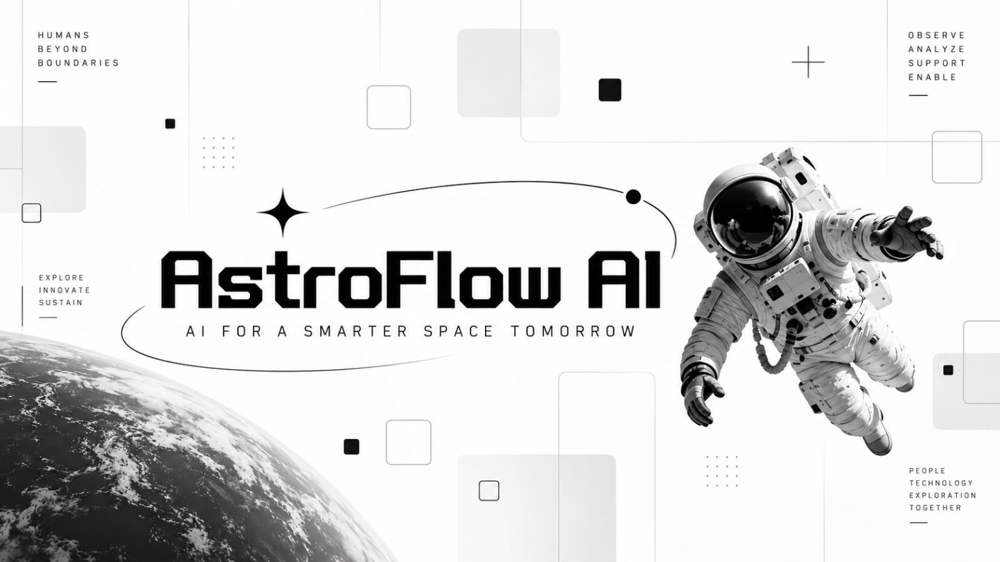
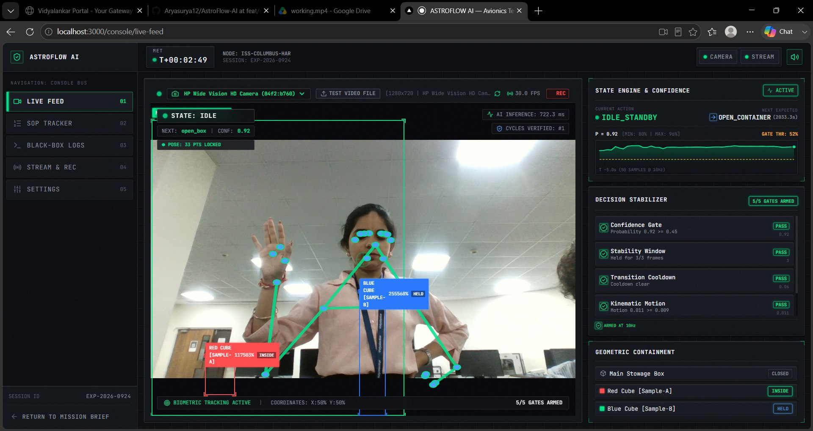
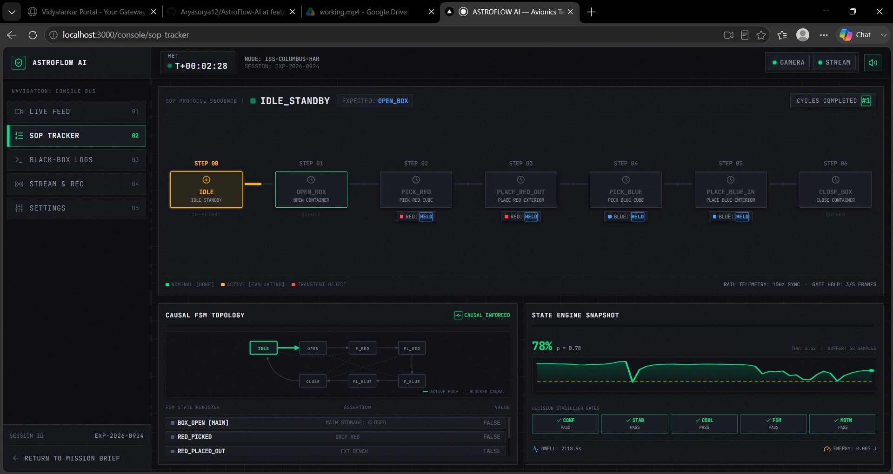
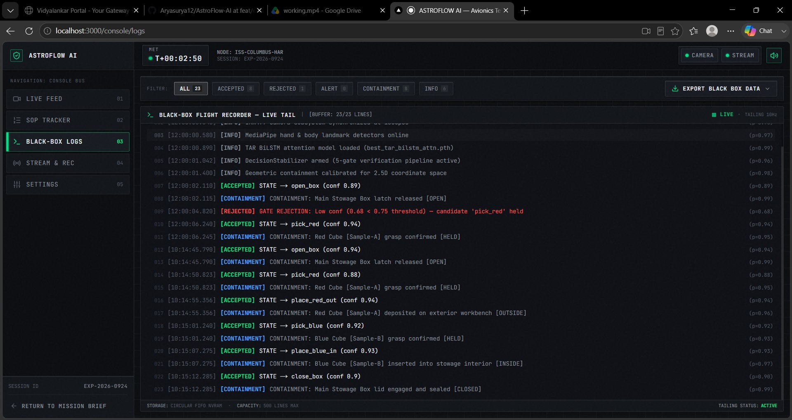
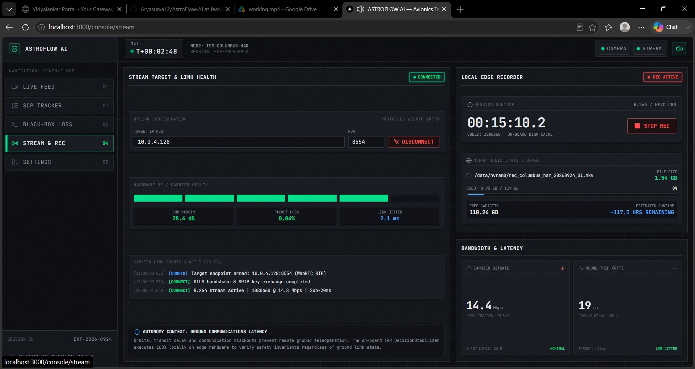
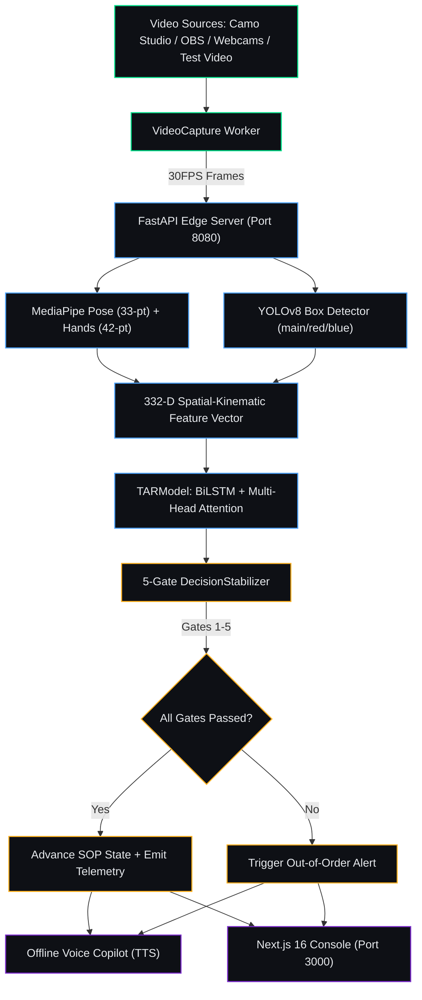
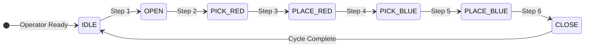

<div align="center">



[](https://github.com/Aryasurya12/AstroFlow-AI)
[](https://github.com/Aryasurya12/AstroFlow-AI)
[](https://github.com/Aryasurya12/AstroFlow-AI)

[](https://nextjs.org/)
[](https://bun.sh/)
[](https://python.org/)
[](https://github.com/Aryasurya12/AstroFlow-AI/stargazers)
[](https://github.com/Aryasurya12/AstroFlow-AI/network/members)
[](https://github.com/Aryasurya12/AstroFlow-AI)

<p align="center">
  <b>Real-Time Edge AI that watches astronauts follow complex procedures — and speaks up when they skip a step.</b><br/>
  <b>100% Offline • Zero Cloud Dependencies • 11.4ms Inference Latency</b>
</p>

</div>

---

## Judge's Quick Start

**TL;DR — Run the full system in 3 commands:**

```bash
git clone https://github.com/Aryasurya12/AstroFlow-AI.git && cd AstroFlow-AI
bun install && .\.venv\Scripts\python.exe -m pip install -r requirements.txt 2>$null; bun run dev:all
```

**What you see:**
- **Port 3000** → Mission Console (browser-based HUD with live camera feed, 5-gate telemetry, SOP tracker)
- **Port 8080** → FastAPI Edge Server (MediaPipe + YOLOv8 + BiLSTM inference)
- **Test suite:** `bun run test:backend` (5/5 pass)

**No camera?** Use `bun run dev:all` with test video mode, or upload any `.mp4` through the console.

---

## Screenshots

<div align="center">

| 01. Live Video Feed & Pose Tracking | 02. SOP Tracker & Causal Directed Graph |
| :---: | :---: |
|  |  |
| *Real-Time Camera Feed, Biometric Pose Skeleton & 5-Gate Telemetry* | *Sequential Flight Plan Strip, Dwell Timers & State Machine Topography* |

| 03. NVRAM Black-Box Flight Recorder | 04. Hardware Settings & Calibration |
| :---: | :---: |
|  |  |
| *Chronological Flight Logs, Multi-Tier Filter & CSV/JSONL Exporter* | *Multi-Camera Source Switcher, Gate Sensitivity Sliders & Model Manifest* |

</div>

---

## What Makes This Different

Most computer vision projects use raw softmax predictions frame-to-frame. That causes flickering, false triggers, and hallucinated state flips. AstroFlow AI solves this with a **deterministic 5-Gate Decision Stabilizer** that every prediction must survive before it's trusted:

### The 5-Gate Decision Stabilizer

| # | Gate | Rule | Why It Matters |
| :--- | :--- | :--- | :--- |
| **1** | **Posterior Confidence** | P ≥ 0.45 per-class | Rejects low-confidence guesses |
| **2** | **Stability Window** | Same prediction across 3+ consecutive frames | Eliminates single-frame flickering |
| **3** | **Transition Cooldown** | 0.40s minimum between state changes | Prevents mechanical rebound / double-triggers |
| **4** | **Kinematic Motion Floor** | Movement energy ≥ 0.009 | Rejects static hallucinations while operator is resting |
| **5** | **Physical Causal Logic** | Checks box state, cube locations, step order | Catches out-of-order actions before they're accepted |

### Model Performance

| Component | Model | Parameters | Inference | Accuracy |
| :--- | :--- | :--- | :--- | :--- |
| **Action Recognition** | BiLSTM + Multi-Head Attention | ~2.4M | **11.4ms** (FP16) | 7-class SOP classification |
| **Object Detection** | YOLOv8 Nano (3-class custom) | ~3.2M | ~8ms | `main_box`, `red_box`, `blue_box` |
| **Pose Estimation** | MediaPipe Holistic | — | ~5ms | 33-pt body + 42-pt hands |
| **Pipeline Total** | — | — | **~25ms** per frame | 30 FPS real-time |
| **Test Suite** | — | 5 tests | 1.042s | **5/5 OK** |

### 100% Offline Voice Copilot

The personal assistant voice copilot has **zero internet or cloud dependencies**. It operates completely offline using a dual-layer architecture:

- **Browser layer:** Web Speech API (offline speech synthesis, no network calls)
- **Backend layer:** `pyttsx3` with Windows SAPI COM (speaks directly through local speaker hardware)

When an astronaut skips a step — e.g., tries to pick the blue cube before placing the red one — the copilot speaks aloud: *"Astronaut, hold on. You missed step 3. Please deposit the red sample cube onto the exterior bracket before proceeding."*

---

## System Architecture

AstroFlow AI is an edge AI avionics console built to monitor astronauts performing procedural experiment workflows inside gloveboxes and orbital workstations.



---

## Procedure (SOP) State Machine

The system tracks a 7-step procedural workflow:

| Step | Step Name | What It Means |
| :--- | :--- | :--- |
| **1** | Open Box | Open the experiment container |
| **2** | Pick Red Cube | Grasp the red sample from inside |
| **3** | Place Red Out | Deposit the red sample on the exterior bracket |
| **4** | Pick Blue Cube | Grasp the blue sample from the workbench |
| **5** | Place Blue In | Insert the blue sample inside the container |
| **6** | Close Box | Latch the container lid — cycle complete |



---

## Telemetry Schema

```
ws://localhost:8080/ws/telemetry  (10Hz push)
```

Each frame includes: `frame_id`, `current_state`, `expected_next`, `confidence`, all 5 gate results, 2.5D containment status, active alerts, FPS, and inference latency.

---

## Key Features

### Real-Time Edge Computer Vision
- **BiLSTM + Attention** neural network processes 332-D spatial-kinematic features from MediaPipe pose/hand landmarks
- **YOLOv8** detects the main container, red cube, and blue cube with HSV-calibrated color validation
- **MotionActionSpotter** uses peak-scoring architecture to eliminate rolling-window jitter

### 5-Gate Anti-Hallucination Pipeline
- Confidence threshold, stability window, transition cooldown, kinematic motion floor, and physical causal logic — all must pass for a state transition
- Out-of-sequence actions are caught and blocked before being accepted

### 100% Offline Voice Copilot
- Zero internet/cloud dependencies
- Windows SAPI COM synthesis (pyttsx3) + browser Web Speech API
- Speaks specific corrections for missed steps in real-time

### Flight Data Recorder
- NVRAM circular buffer logs `[ACCEPTED]`, `[REJECTED]`, `[ALERT]`, `[CONTAINMENT]` events
- Export as CSV or JSONL for mission debriefing

### Multi-Camera Support
- Camo Studio, OBS Virtual Camera, USB webcams — all auto-detected
- Upload test videos (`.mp4`, `.mkv`, `.avi`, `.webm`) for offline benchmarking

---

## Prerequisites

| Dependency | Min Version | Recommended | Purpose |
| :--- | :--- | :--- | :--- |
| **Bun** | v1.1.0+ | v1.3.9 | JS bundler & package manager |
| **Python** | 3.10.x | 3.10.11 | PyTorch, MediaPipe, OpenCV |
| **Git** | 2.30+ | Latest | Branch tracking |
| **Docker** *(Optional)* | v20.10+ | Latest | Container deployment |

---

## Quick Start

#### Option A: One-Command Launcher (Recommended)
```bash
bun run dev:all   # Starts both FastAPI edge server + Next.js console
```

#### Option B: Manual Setup
```bash
# Terminal 1 — AI Edge Server (port 8080)
.venv\Scripts\python.exe -m uvicorn ai_engine.server:app --host 0.0.0.0 --port 8080

# Terminal 2 — Mission Console (port 3000)
bun run dev
```

#### Option C: Docker
```bash
docker compose up --build
```

---

## Automated Test Suite

```bash
bun run test:backend
```

```
[+] test_01_tar_model_forward               ... OK
[+] test_02_causal_logic_nominal_sequence   ... OK
[+] test_03_causal_logic_step_skip_rejection ... OK
[+] test_04_decision_stabilizer_5_gates      ... OK
[+] test_05_camera_enumeration              ... OK

STATUS: ALL BACKEND AUDITS VERIFIED
```

---

## Console URL Reference

| Interface | URL | Description |
| :--- | :--- | :--- |
| Mission Console | `http://localhost:3000` | Main dashboard |
| Live Video Feed | `http://localhost:3000/console/live-feed` | Camera canvas + pose tracking + 5-gate telemetry |
| SOP Tracker | `http://localhost:3000/console/sop-tracker` | FSM graph + flight plan strip |
| Black-Box Logs | `http://localhost:3000/console/logs` | Flight logs + CSV/JSONL export |
| Settings | `http://localhost:3000/console/settings` | Camera selector + gate sliders |
| FastAPI Health | `http://localhost:8080/health` | Subsystem diagnostics |
| Telemetry Stream | `ws://localhost:8080/ws/telemetry` | 10Hz live state & gate stream |

---

## Directory Layout

```
AstroFlow-AI/
|-- ai_engine/                         # Python Edge AI Pipeline
|   |-- models/                        # Pre-trained weights
|   |   |-- best_tar_model.pth         # BiLSTM + Attention weights
|   |   +-- yolo_boxes.pt              # Fine-tuned YOLOv8 weights
|   |-- camera.py                      # Multi-device camera detection & grabber
|   |-- feature_utils.py               # 332-D spatial feature assembly
|   |-- model_def.py                   # PyTorch TARModel definition
|   |-- pipeline.py                    # Real-time inference pipeline
|   |-- pose_extract_advanced.py       # MediaPipe Pose & Hands extraction
|   |-- realtime.py                    # 5-Gate DecisionStabilizer & Causal FSM
|   |-- server.py                      # FastAPI REST & WebSocket server
|   +-- tts.py                         # Offline Voice Copilot
|-- app/                               # Next.js 16 App Router
|   |-- console/                       # Mission Console routes
|   +-- page.tsx                       # Console entry briefing
|-- components/                        # Avionics UI library
|-- context/                           # React telemetry context
|-- lib/                               # TypeScript models & client APIs
|-- scripts/                           # Unified runners
|-- tests/                             # Backend test suite
|-- Dockerfile                         # Production container
|-- docker-compose.yml                 # Multi-container orchestration
|-- assets/                            # Screenshots & banner images
|-- requirements.txt                   # Python dependencies
|-- package.json                       # Node.js dependencies & scripts
```

---

<div align="center">


<p align="center">
  <b>AstroFlow AI — Autonomous Avionics Platform</b><br/>
  Mission Node: ISS-COLUMBUS-HAR | Session: EXP-2026-0924
</p>

</div>